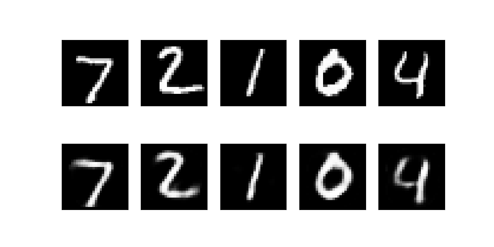

# Machine Learning - 2024


## Description

This project implements machine-learning algorithms. For more details, please refer to `./pdf/consignes.pdf`.

<p align="center">
  
  <br/>
  <strong>Autoencoder for numbers with mnist_train.csv dataset for training</strong>
</p>


## Requirements

Make sure you have `Python >= 3.10` installed.


## Install the Project

1. Clone the repository:
   ```bash
   git clone https://github.com/Ant0in/Projet5-IA.git
   ```

2. Navigate to the **project directory**:
   ```bash
   cd Projet5-IA/
   ```

3. **Install** the project dependencies (*Highly recommend using a **venv***):
   ```bash
   pip install -r '.\requirements.txt'
   ```


## Usage

When installed, run the project through the `main.py` file. 
The main file is located at `Projet5-IA/main.py`.

### Required Parameters (positional):
- The dataset path `dataset_path` which will be used to train the model. Value must be a **string** and a **valid model**.

### Training Parameters (positional, have default values)

For this section, please refer to `./pdf/consignes.pdf` to understand every parameters. Default values are accessibles with the argparser in the `main.py` file.

- **Learning Rate** `learning_rate`. Value must be a **float** between `0` and `1`.
- **Encoded Dimension** `encoded_dim`. Value must be a **positive integer** (greater than `0`).
- **Batch size** `batch_size`. Value must be a **positive integer** (greater than `0`).
- **Epochs** `epochs`. Value must be a **positive integer**.


### Optional parameters : 

- `--verbose`: Enables or disables verbose mode. **Enabled by default**.
- `--log_path`: Enables logging into a log file @ `log_path`. If no path is given, this will be disabled.


### Running Examples:

```bash
python .\main.py --dataset .\dataset\mnist_train.csv --learning_rate 0.01 --batch_size 32 --epochs 10
```


## License

This project is licensed under the **MIT License**. You are free to use, modify, and distribute this software.


## Acknowledgements

This project was developed for the Artificial Intelligence course `INFO-F311`. Special thanks to `Tom Lenaerts & Pascal Tribel (ULB)` for their guidance and support.

